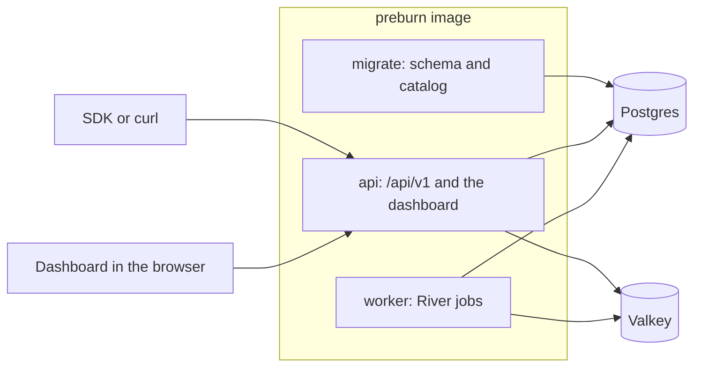

# Architecture

Preburn is one Go binary and one Docker image. Compose runs the image three times, as `migrate`, `api` and `worker`, next to Postgres and Valkey. The React dashboard is compiled into the binary.

## Components

| Component | Command | Role |
|---|---|---|
| migrate | `preburn migrate` | Applies the SQL migrations and River's migrations, then imports the curated pricing files and the LiteLLM snapshot embedded in the binary. Runs under a Postgres advisory lock, so concurrent runs wait for each other. |
| api | `preburn serve` | Serves the HTTP API on `/api/v1`, the dashboard on `/`, the health routes, and metrics on a separate port. Inserts jobs into River. |
| worker | `preburn worker` | Works the River job queues and runs the periodic jobs on the elected leader. |
| Postgres | | The source of truth for every record, and River's job queue. |
| Valkey | | The customer period counters, reservations, the decision stream, rate limit windows and the invalidation channel. |

The dashboard is a React app built with Vite and embedded with the `embedweb` build tag. The api answers every path outside `/api/` with it, and files under `/assets/` with long-lived cache headers.

## Code layout

| Path | Contents |
|---|---|
| `cmd/preburn` | The commands. |
| `internal/app` | Wiring: opens the pools, creates the services, registers every route and job. |
| `internal/httpapi` | The HTTP framework on Huma v2: route groups, authentication, problems, lists, middleware. |
| `internal/decisions` | Check, report, release, the Valkey counters and their Lua scripts, expiry, repair, rebuild, retention. |
| `internal/policies`, `internal/signals` | Policy documents, validation and resolution, and the signal computation. Both are pure, so they need no database to test. |
| `internal/pricing`, `internal/catalogfiles` | The rating engine, the catalog import and overrides. |
| `internal/ledger`, `internal/revenue` | Ledger entries, rollups, usage estimates, re-rating, and revenue. |
| `internal/customers`, `internal/customerstate`, `internal/plans` | Customers, their period state and plans. |
| `internal/members`, `internal/apikeys`, `internal/installation` | Members and sessions, API keys, setup and settings. |
| `internal/dashboard` | The dashboard's read routes and the decision stream. |
| `db/migrations`, `db/queries` | SQL migrations and the sqlc queries of each domain. |
| `catalog` | The curated pricing files, aliases, parameter mappings and the LiteLLM snapshot. |
| `web` | The dashboard. |
| `api/openapi.json` | The generated OpenAPI document. |

## Request path of a check

1. The API key is resolved from an in-process cache, 30 seconds per key, which fixes the environment.
2. The request is validated: the feature name, known meters, quantity strings and at most 32 attributes.
3. The customer is resolved by external id from an in-process cache and created when unknown, and so is the customer user.
4. The customer state loads from a 30 second cache: the effective plan, the current period and its net revenue from the period rollup.
5. The usage estimate, or the ceiling when there is no estimate, is priced for the requested model from the environment's rule set, cached for 5 minutes. This is `request_estimated_cost`.
6. The customer's period counter is read from Valkey, and the signals are computed.
7. The active policies of the environment, cached for 60 seconds, are resolved. The chosen outcome picks the route target, re-prices a cap's overrides, or denies.
8. The reservation amount and the ceilings are chosen, and the `reserve` Lua script adds the reservation to the counter atomically, or refuses it when a hard allowance or a cap limit would be exceeded. A deny only counts.
9. The decision row is inserted in Postgres and appended to the environment's decision stream in Valkey, which feeds the dashboard's live view.

The Valkey steps of a check have 150 ms. A Valkey failure or timeout answers 503 `counters_unavailable` and a Postgres failure 503 `database_unavailable`, and the SDK falls back in both cases.

A report runs one Postgres transaction that inserts the ledger entry once per decision or idempotency key, prices the usage, marks the decision settled and enqueues the refresh of the customer's period rollup. After the commit, the `settle` script moves the cost from reserved to settled in the counter. When Valkey fails at that point, the report still succeeds and the repair job corrects the counter.

## Postgres and Valkey

Postgres holds the installation, members and sessions, API keys, meters, pricing rules and overrides, plans, customers, policies, decisions, the ledger, revenue entries, period rollups, usage estimates and River's jobs. Everything a check needs to decide can be rebuilt from it.

Valkey holds, under `PREBURN_REDIS_KEY_PREFIX`:

- One counter per customer period with settled cost, reserved cost and decision count, in total and per feature, changed only by Lua scripts that use integer arithmetic.
- One entry per open reservation, and a sorted set of reservations by expiry time.
- A `counters_ready` marker. Every counter script refuses to run without it. When it is missing, as after Valkey restarts without its data, the first process to take the rebuild lock rebuilds every live counter from Postgres, and checks answer 503 `counters_unavailable` until it is done.
- The decision stream of each environment, the daily dropped report counts and the sign-in rate limit windows.
- The `invalidate` channel. A process that changes an API key, customer, plan, policy, price or setting publishes the change, and every api process clears the affected entries of its in-process caches.

Checks and reports register pending changes on a counter until both Postgres and Valkey hold them, so the repair job never counts a change twice.

## Jobs

The worker runs these jobs on River:

| Job | When | Work |
|---|---|---|
| `reservations_expire` | every 5 seconds | Releases the reservations whose hold time passed and marks their decisions expired. |
| `counters_reconcile` | every 60 seconds | Repairs the counters that drifted from the decisions and ledger entries in Postgres: the counters with recent activity on every run, and every live counter once an hour. |
| `rollup_refresh` | after reports, releases, expiries and denies | Recomputes the customer's period rollups: net revenue, cost, uncosted count and decisions by outcome. At most one pending job per customer period. |
| `usage_estimates_refresh` | every hour | Stores the 95th percentile usage per feature, provider, model and meter with at least 50 ledger entries in the last 30 days. |
| `uncosted_rerate` | after an override change | Prices the uncosted ledger entries of the last 90 days that now have a price, as correction entries. |
| `decision_retention` | daily at 03:00 UTC | Deletes the decisions older than `PREBURN_DECISION_RETENTION_DAYS`. |
| `member_cleanup` | daily at 04:00 UTC | Deletes expired sessions and old member links. |
| `pricing_litellm_refresh` | daily at 05:00 UTC | Imports LiteLLM's current price list. Only with `PREBURN_PRICING_LITELLM_REFRESH=true`. |

Periodic jobs run on the elected leader among the workers. Each job runs in its own trace span when tracing is on.

## Security

- Passwords are hashed with argon2id. Session tokens, link tokens and API keys are stored as SHA-256 hashes.
- Stored secrets are encrypted with AES-256-GCM under `PREBURN_SECRET_KEY`.
- Dashboard responses carry a strict Content Security Policy, `X-Content-Type-Options: nosniff` and `Referrer-Policy: strict-origin-when-cross-origin`.
- Error responses never repeat request values, and logs never hold passwords, tokens or keys.
- Preburn makes no outbound calls unless `PREBURN_PRICING_LITELLM_REFRESH` or an OpenTelemetry endpoint is set.
