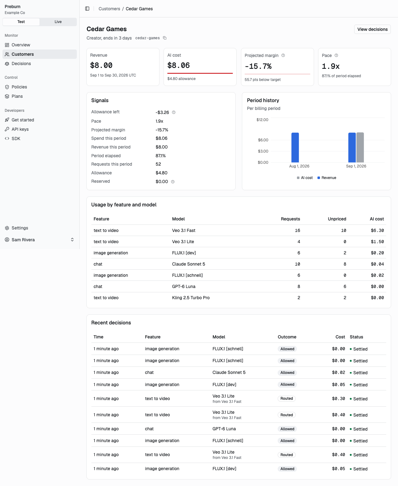
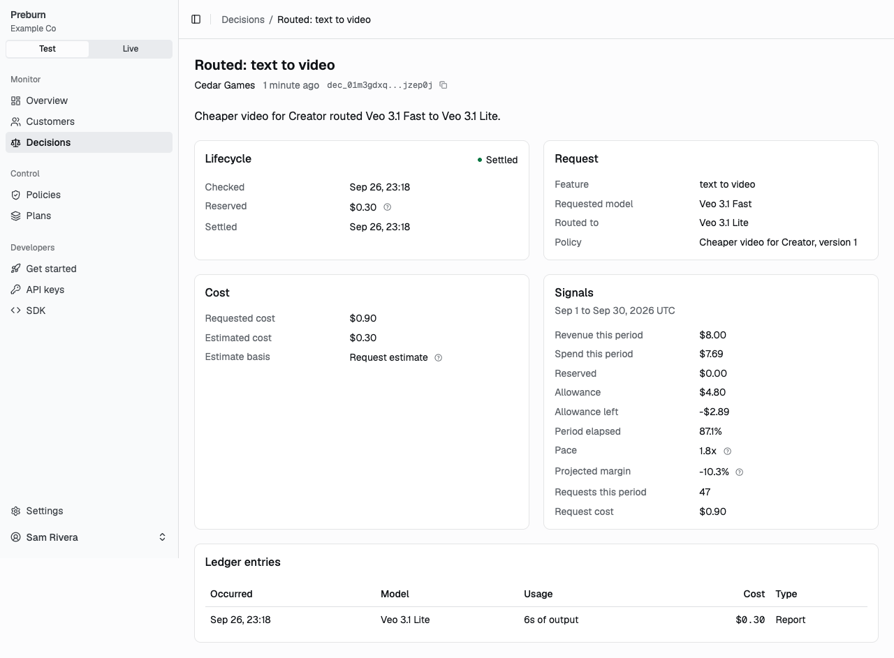

# Concepts

This page defines the words Preburn uses and explains how a decision is made, from the customer's period to the reservation that settles when the usage is reported.

## Glossary

| Term | Meaning |
|---|---|
| installation | One running Preburn deployment, used by one company. |
| environment | `test` or `live`. Every business record belongs to one, and every API key acts in one. |
| member | A person who signs in to the dashboard. Every member has full access. |
| member link | A one-time link that accepts an invite or resets a password. |
| API key | A secret your services send to call Preburn, with the scope `runtime` or `admin`. |
| customer | Your end customer, known by the `external_id` your app gives it. |
| customer user | An optional seat inside a customer, such as one person of a team plan. |
| feature | A tag that names the product capability a call serves, such as `text_to_video`. |
| plan | A pricing plan that sets the AI cost allowance of its customers, with a margin target or a fixed allowance. |
| meter | A named usage quantity from a fixed list, such as `output_seconds`. |
| pricing rule | The price of one meter of one provider model under attribute conditions, from the catalog. |
| pricing override | A price of your installation that adjusts a catalog rule or stands alone. |
| decision | The result of a check: an outcome and a reservation. |
| reservation | The cost a decision holds against the customer's period counter until it is settled, released or expires. |
| ledger entry | An append-only record of the usage of one request and its cost. |
| revenue entry | An append-only record of recognized revenue for a customer period. |
| rollup | Stored totals of revenue, cost and decisions for one customer period. |
| policy | A rule that maps conditions on signals to an outcome. |
| signal | A margin metric computed for a customer, such as `pace`. |
| outcome | `allow`, `route`, `cap` or `deny`. |

## Environments

Every record belongs to the `test` or the `live` environment, and the two never see each other's data. Use `test` while you integrate, then create `live` keys for production.

- An API key acts in the environment it was created in: `pb_test_...` keys read and write test data, `pb_live_...` keys live data.
- The dashboard has a Test and Live switch at the top of the sidebar. Every dashboard request names the environment in the `X-Preburn-Environment` header.
- An id from the other environment answers 404 `not_found`.

## Identifiers

Preburn ids are a type prefix, an underscore and 26 lowercase characters, such as `cust_01jbvagescfn78y0938nkrkayd`.

| Record | Prefix |
|---|---|
| member | `mem` |
| member link | `mlk` |
| API key | `key` |
| customer | `cust` |
| customer user | `cuser` |
| plan | `pln` |
| pricing rule | `prc` |
| pricing override | `pro` |
| policy | `pol` |
| decision | `dec` |
| ledger entry | `led` |
| revenue entry | `rev` |

Your app names customers and customer users by its own ids (`customer_id` and `customer_user_id` in checks and reports): 1 to 128 letters, digits or the characters `.`, `_`, `:`, `@` and `-`. They are unique per environment and match with letter case. A check or a revenue entry that names an unknown customer creates it.

## Money, quantities and time

- Amounts are USD decimal strings. Requests take at most 9 decimals, such as `"49.00"`, and responses always carry 9, such as `"49.000000000"`. Preburn stores them as whole nano-dollars, so sums are exact.
- Usage quantities are non-negative decimal strings with at most 6 decimals, such as `{"output_seconds": "8"}` or `{"input_tokens": "1200"}`.
- Ratios, such as a target margin or a `pace` threshold, are decimal strings with at most 4 decimals, such as `"0.40"`.
- JSON numbers are rejected for amounts, quantities and ratios.
- Timestamps are RFC 3339 in UTC, such as `2026-09-27T00:30:08Z`.

## Customers and periods

Every signal is computed for the customer's current period. At a given moment it is the first of:

1. The period of the latest-starting `subscription` revenue entry whose period contains that moment.
2. The UTC calendar month.

A customer's plan is the plan set on the customer, else the default plan of the environment, set in Settings. A customer with neither has an allowance of 0.

Create or replace a customer with `PUT /api/v1/customers/{external_id}`, which sets its display name, plan and metadata. A check for an unknown customer creates it without a plan, so it follows the default plan.

## Plans

A plan sets the AI cost allowance of its customers for each period in one of two modes:

| Mode | Allowance |
|---|---|
| `margin_target` | The period's net revenue times one minus the target margin, and never below 0. A target margin of `0.40` on $49 of revenue allows $29.40 of AI cost. |
| `fixed_allowance` | A fixed amount per period, such as `"2.00"`. |

A plan also holds a hold time per feature, from 30 to 86,400 seconds: how long a decision's reservation lasts before it expires. Features without one hold for 10 minutes. Plans are archived, never deleted, and the default plan of an environment cannot be archived.

## Revenue

A revenue entry records an amount of one kind for one customer period, through `POST /api/v1/revenue` or the SDK's `revenue.record`.

| Kind | Effect on net revenue |
|---|---|
| `subscription` | adds |
| `adjustment` | adds |
| `stripe_fee` | subtracts |
| `refund` | subtracts |
| `credit_note` | subtracts |

Amounts are never negative, and the kind sets the sign. A period lasts at most 400 days, and a one-time line has `period_end` equal to `period_start`. The `source_reference`, such as your invoice id, is unique per environment and kind, so sending an entry again returns the stored one with `duplicate: true`. An entry counts in the latest-starting billing period that contains its period start, so prorations and one-time lines fold into the period around them.

## Signals

Signals measure where a customer stands in the current period. Policies compare them with fixed values, and every check response carries them.

| Signal | Definition |
|---|---|
| `period_revenue_net` | Subscription and adjustment revenue minus fees, refunds and credit notes attributed to the period. |
| `cost_to_date` | Settled AI cost of the period. |
| `allowance_remaining` | The plan's allowance minus `cost_to_date` minus the cost reserved by open decisions. Negative once over the allowance. |
| `elapsed_fraction` | The elapsed share of the period, at least 0.01. |
| `pace` | The share of the allowance spent divided by `elapsed_fraction`. 1.0 spends the allowance exactly by the end of the period, 2.0 twice as fast. With an allowance of 0 it is `inf` once there is cost, else 0. |
| `projected_margin` | The margin the period ends with at the current rate: 1 minus (`cost_to_date` divided by `elapsed_fraction`) divided by `period_revenue_net`. Without revenue it is `-inf` once there is cost, else 0. |
| `request_estimated_cost` | The priced cost of the request's usage estimate, or of its ceiling when it has no estimate. It has no value when the request cannot be priced, and a condition on it then fails. |
| `period_decision_count` | Decisions for the customer in the period. |

Money signals compare exactly. The check response also carries `cost_allowance`, `reserved` and the cost, reserved amount and decision count of each feature, which the dashboard shows but policies do not compare. A check's signals describe the period before its own reservation.

## Outcomes

| Outcome | What your app does |
|---|---|
| `allow` | Run the call as requested. |
| `route` | Run the call on the `provider` and `model` of the decision, with its `overrides`. |
| `cap` | Run the call with the decision's `overrides` applied, such as a shorter duration. |
| `deny` | Do not run the call. |

The response's `reason` says why:

| Reason | Meaning |
|---|---|
| `no_policy_matched` | No active policy matched, so the call is allowed. |
| `policy_matched` | The matched policy decided the outcome. `matched_policy_id` names it. |
| `hard_limit_reached` | A hard policy's allowance or a cap's limit would be exceeded, so the call is denied. |
| `route_chain_exhausted` | No route target could be priced or fit a hard ceiling, so the call is denied. |
| `uncosted_allowed` | The call cannot be priced and is allowed, by the policy's `on_uncosted` or because no policy matched. |
| `uncosted_denied` | The call cannot be priced and the policy's `on_uncosted` denies it. |
| `cap_not_applicable` | The cap has no override the requested model supports and no limit, so the call is allowed. |

## Decision lifecycle

1. `POST /api/v1/check` decides and reserves. Every outcome except deny reserves a cost against the customer's period counter, and `reserved_amount` says how much. `estimate_basis` says which usage it priced:
   - A hard policy reserves the cost of `usage_ceiling`, else of `usage_estimate`.
   - Otherwise the reservation is the cost of the 95th percentile usage of the feature, provider and model once the last 30 days hold at least 50 ledger entries of it (`p95`, refreshed every hour). Before that it is the cost of the ceiling, else of the estimate, else nothing (`none`).
2. `POST /api/v1/report` with the `decision_id` prices the measured usage, stores one ledger entry per decision and moves the cost from reserved to settled. A second report of the same decision returns the first entry with `duplicate: true`. Report attributes replace the decision's attributes of the same key before pricing.
3. `POST /api/v1/release` frees the reservation of a call that did not run. Releasing again changes nothing.
4. A reservation that is neither reported nor released expires after the plan's hold time for the feature, 10 minutes by default. A report after expiry still records the usage.

A decision's `status` is `reserved`, `settled`, `released`, `expired`, or `unreserved` for a deny, which holds nothing. Reporting a denied decision answers 409 `decision_not_reportable`.

Decisions are deleted after `PREBURN_DECISION_RETENTION_DAYS`, 90 by default. Ledger entries and revenue entries are never deleted.

## Fallback

The SDK gives each check 250 ms. When Preburn cannot be reached in time, or answers 502, 503 or 504, the SDK returns a fallback decision instead of raising. Its outcome is the `fallback_outcome` of the last successful check for the same customer and feature, else for the feature, else `allow`. `fallback_outcome` is the `on_unreachable` setting of the policy that matched, `allow` or `deny`, and `allow` when none matched.

A fallback decision reserves nothing. Its report goes to Preburn with `decision_source: "fallback"` and an idempotency key the SDK created, and counts in the period that contains its `occurred_at`. A check answers 503 `counters_unavailable` or `database_unavailable` when Valkey or Postgres fails, which also makes the SDK fall back.

## Pricing

Preburn prices usage by meter. Each provider model has pricing rules, and a rule prices one meter under conditions on the request's attributes, such as `resolution: 1080p`.

| Meter | Unit |
|---|---|
| `input_tokens` | token |
| `cached_input_tokens` | token |
| `cache_write_input_tokens` | token |
| `output_tokens` | token |
| `reasoning_tokens` | token |
| `input_audio_tokens` | token |
| `output_audio_tokens` | token |
| `input_seconds` | second |
| `output_seconds` | second |
| `gpu_seconds` | second |
| `characters` | character |
| `images` | image |
| `megapixels` | megapixel |
| `audio_minutes` | minute |
| `requests` | request |
| `search_requests` | request |

- Rules come from the curated files under `catalog/pricing/` and from a snapshot of LiteLLM's model price list that ships with each release. `preburn migrate` imports both. With `PREBURN_PRICING_LITELLM_REFRESH=true` the worker downloads the current LiteLLM list every day at 05:00 UTC. A changed price closes the old rule and opens a new one, so past usage keeps its price.
- Some models have alias names, such as an image-to-video variant priced like its text-to-video model. Checks, reports and policies accept either name.
- A pricing override sets your own price for a meter of a model. An override with the same provider, model, meter and conditions as a catalog rule adjusts that rule's price. Any other override stands alone and prices a model or meter the catalog lacks. Overrides can use a native unit, such as provider credits, with its USD price. Ending an override keeps it as the price history of the usage it priced.
- A meter without a price leaves the request `uncosted`. The check follows the matched policy's `on_uncosted`, or allows. `GET /api/v1/pricing/uncosted` lists uncosted usage, and adding the missing price through an override re-prices the uncosted usage of the last 90 days.
- `POST /api/v1/pricing/quote` prices a request without storing anything.

Each meter line is priced once and rounded half up to the nano-dollar. A request's cost is the sum of its lines.
