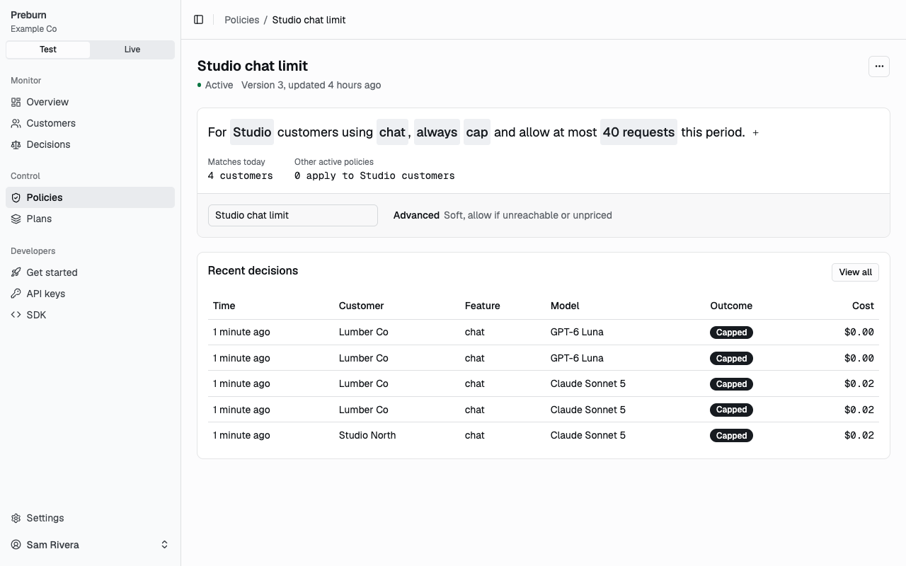

# Policies

A policy tells Preburn what to do with a check when a customer's signals meet its conditions: allow the call, route it to another model, cap it, or deny it. Members write policies in the dashboard's sentence builder under Policies. Scripts use the admin API with an admin key. Both store the same JSON document.



## Document

| Field | Rules |
|---|---|
| `name` | 1 to 120 characters. |
| `level` | `everyone`, `plan` or `customer`. |
| `plan_id` | The plan, such as `pln_01jbvagescfn78y0938nkrkayd`, for level `plan`. It must be an active plan of the environment. Null or absent otherwise. |
| `customer_id` | The customer's Preburn id, such as `cust_01jbvagescfn78y0938nkrkayd`, not its external id, for level `customer`. Null or absent otherwise. |
| `feature` | The feature the policy applies to, matching `^[a-z][a-z0-9_]{0,63}$`, or null for every feature. |
| `when` | The condition group. See [Conditions](#conditions). |
| `action` | The outcome and its details. See [Actions](#actions). |
| `enforcement` | `soft` or `hard`. See [Enforcement](#enforcement). |
| `on_unreachable` | `allow` or `deny`: the outcome the SDK uses when it cannot reach Preburn. |
| `on_uncosted` | `allow` or `deny`: the outcome when the request cannot be priced. |
| `status` | `active`, `disabled` or `archived`. Only active policies take part in checks. `active` when omitted. |

The server adds `id` (`pol_...`), `version`, `created_at` and `updated_at`. A plan-level policy applies to the customers of its plan, and customers without a plan count as customers of the default plan. A customer-level policy applies to its customer only.

## Conditions

`when` is a group, `{"all": [...]}` or `{"any": [...]}`. Its members are conditions or nested groups, at most 3 groups deep. An `all` group holds when every member holds, so an empty `all` always holds. An `any` group holds when one member holds and needs at least one member.

A condition compares a [signal](concepts.md#signals) with a value:

```json
{"signal": "pace", "operator": "gt", "value": "1.5"}
```

| Field | Values |
|---|---|
| `signal` | `period_revenue_net`, `cost_to_date`, `allowance_remaining`, `elapsed_fraction`, `pace`, `projected_margin`, `request_estimated_cost`, `period_decision_count` |
| `operator` | `lt`, `lte`, `gt`, `gte`, `eq`, `ne`, with the signal on the left |
| `value` | A string. An amount in USD for `period_revenue_net`, `cost_to_date`, `allowance_remaining` and `request_estimated_cost`, such as `"2.50"`. A ratio with at most 4 decimals for `elapsed_fraction`, `pace` and `projected_margin`, such as `"0.40"`. A whole number for `period_decision_count`, such as `"100"`. |

A condition on `request_estimated_cost` fails when the request cannot be priced.

## Actions

| `action.outcome` | Fields | Effect |
|---|---|---|
| `allow` | none | Runs the call as requested. |
| `route` | `route_chain`, optional `overrides` | Runs the call on the first target of `route_chain` that can be priced. A hard policy that matched through `allowance_remaining` also skips targets whose reservation exceeds the remaining allowance. When no target qualifies, the call is denied with reason `route_chain_exhausted`. |
| `cap` | `overrides`, `limit` or both | Runs the call with the overrides applied, within the limit. |
| `deny` | none | Rejects the call. |

- `route_chain` lists 1 to 5 targets in order, each `{"provider": "...", "model": "..."}`. A model alias is stored as the model it names.
- `overrides` maps parameter names to values, such as `{"duration": "4s", "audio": false}`. A route override must suit every target, and a cap override must suit at least one model of the [parameter mappings](#parameter-mappings). At check time a cap applies only the overrides the requested model supports and prices the call with them, so the decision's `estimated_cost` is the cost of the capped call. A cap with no override the model supports and no limit allows the call with reason `cap_not_applicable`.
- `limit` is `{"kind": "count", "value": "40"}` or `{"kind": "amount", "value": "25.00"}`: the most decisions, or the most cost, per customer period for the policy's feature, or for every feature when `feature` is null. Calls within the limit get outcome `cap`. The call that would pass it is denied with reason `hard_limit_reached`.

## Enforcement

- `soft` compares the signals once, when the check reads them. Concurrent checks can each pass a threshold that only one of them should pass.
- `hard` reserves the cost of the request's `usage_ceiling` when it has one, and when the policy matched through an `allowance_remaining` condition, the reservation checks the remaining allowance atomically. A call that would exceed it is denied with reason `hard_limit_reached`, however many checks run at once.

Cap limits are always checked atomically.

## Resolution

For each check Preburn takes the active policies of the environment whose `feature` is null or the request's feature and whose scope includes the customer, then:

1. Evaluates each policy's `when` against the customer's signals.
2. Keeps the matches of the most specific level: `customer`, else `plan`, else `everyone`.
3. Picks the most restrictive outcome within that level: `deny`, then `cap`, then `route`, then `allow`. Ties go to the latest `updated_at`, then the lowest id.
4. With no match, allows the call with reason `no_policy_matched`.

The matched policy also sets `fallback_outcome` in the response from its `on_unreachable`, and decides uncosted requests by its `on_uncosted`. With no match both are `allow`.

## Parameter mappings

Overrides use Preburn's parameter names, the same for every provider. `GET /api/v1/policies/parameter-mappings` lists, per provider model, each parameter that overrides can set: its provider parameter, its values and the meter it changes. For example, on `fal-ai/veo3.1/fast`:

| Parameter | Provider parameter | Values | Effect |
|---|---|---|---|
| `duration` | `duration` | `4s`, `6s`, `8s` | sets `output_seconds` to 4, 6 or 8 |
| `resolution` | `resolution` | `720p`, `1080p`, `4k` | selects the `output_seconds` price |
| `audio` | `generate_audio` | `true`, `false` | selects the `output_seconds` price |

The check response names overrides by Preburn parameter, and your app sets each one on the provider parameter the mapping names. The mappings come from `catalog/parameter_mappings.yaml`.

## Examples

Create a policy with an admin key:

```sh
curl -sS "$PREBURN_BASE_URL/api/v1/policies" \
  -H "Authorization: Bearer $PREBURN_ADMIN_KEY" \
  -H "Content-Type: application/json" \
  --data @policy.json
```

### Stop at the allowance

Two policies on a fixed allowance plan. The first matches while allowance remains and, being hard, denies a call whose reservation would exceed it, even under concurrent checks. The second denies every call once the allowance is spent.

```json
{
  "name": "Allow within allowance",
  "level": "plan",
  "plan_id": "pln_01jbvagescfn78y0938nkrkayd",
  "feature": null,
  "when": {"all": [{"signal": "allowance_remaining", "operator": "gt", "value": "0"}]},
  "action": {"outcome": "allow"},
  "enforcement": "hard",
  "on_unreachable": "allow",
  "on_uncosted": "allow"
}
```

```json
{
  "name": "Deny past allowance",
  "level": "plan",
  "plan_id": "pln_01jbvagescfn78y0938nkrkayd",
  "feature": null,
  "when": {"all": [{"signal": "allowance_remaining", "operator": "lte", "value": "0"}]},
  "action": {"outcome": "deny"},
  "enforcement": "soft",
  "on_unreachable": "deny",
  "on_uncosted": "deny"
}
```

### Route to a cheaper model on a heavy pace

Customers of the plan who spend their allowance more than 1.2 times as fast as the period elapses get video from `fal-ai/veo3.1/lite`, or from the Kling model when that one cannot be priced.

```json
{
  "name": "Cheaper video on heavy pace",
  "level": "plan",
  "plan_id": "pln_01jbvagescfn78y0938nkrkayd",
  "feature": "text_to_video",
  "when": {"all": [{"signal": "pace", "operator": "gt", "value": "1.2"}]},
  "action": {
    "outcome": "route",
    "route_chain": [
      {"provider": "fal_ai", "model": "fal-ai/veo3.1/lite"},
      {"provider": "fal_ai", "model": "fal-ai/kling-video/v2.5-turbo/pro/text-to-video"}
    ]
  },
  "enforcement": "soft",
  "on_unreachable": "allow",
  "on_uncosted": "allow"
}
```

### Cap video length and audio on a low margin

For every customer whose projected margin is below 20 percent and who either spends fast or asks for an expensive video, generate 4 seconds without audio.

```json
{
  "name": "Short silent video on low margin",
  "level": "everyone",
  "feature": "text_to_video",
  "when": {
    "all": [
      {"signal": "projected_margin", "operator": "lt", "value": "0.20"},
      {"any": [
        {"signal": "pace", "operator": "gt", "value": "1.5"},
        {"signal": "request_estimated_cost", "operator": "gt", "value": "1.00"}
      ]}
    ]
  },
  "action": {"outcome": "cap", "overrides": {"duration": "4s", "audio": false}},
  "enforcement": "soft",
  "on_unreachable": "allow",
  "on_uncosted": "allow"
}
```

A check for an 8 second `fal-ai/veo3.1/fast` video with audio then answers:

```json
{"outcome": "cap", "reason": "policy_matched", "model": "fal-ai/veo3.1/fast", "overrides": {"audio": false, "duration": "4s"}, "estimated_cost": "0.400000000"}
```

### Limit requests per period

Customers of the plan get at most 40 chat decisions per period. The 41st check is denied with reason `hard_limit_reached`.

```json
{
  "name": "Chat limit for Creator",
  "level": "plan",
  "plan_id": "pln_01jbvagescfn78y0938nkrkayd",
  "feature": "chat",
  "when": {"all": []},
  "action": {"outcome": "cap", "limit": {"kind": "count", "value": "40"}},
  "enforcement": "soft",
  "on_unreachable": "allow",
  "on_uncosted": "allow"
}
```

## Preview

`POST /api/v1/policies/preview` takes a draft document and counts the active customers it applies to (`evaluated_customer_count`) and those whose signals meet its conditions now (`matched_customer_count`). It stores nothing. A condition on `request_estimated_cost` counts as met and sets `request_dependent: true`, because it depends on each request. An environment with more than 50,000 active customers answers 422 `preview_too_large`.

## Changes and versions

`PATCH /api/v1/policies/{policy_id}` replaces each top-level field the request holds. `when` and `action` are replaced as a whole, and null clears `plan_id`, `customer_id` and `feature`. Every change increments `version`. Policies are never deleted: set `status` to `disabled` to keep a policy for later, or `archived` to retire it.

## Validation

An invalid document answers 422 `policy_invalid` with one entry per invalid field, located by its JSON path:

```json
{
  "status": 422,
  "code": "policy_invalid",
  "errors": [
    {"location": "body.when.any", "message": "expected at least one member in an any group"},
    {"location": "body.action.route_chain", "message": "expected 1 to 5 route targets for outcome route"}
  ]
}
```

A plan-level policy whose plan is missing from the environment or archived answers 422 `plan_not_found` instead.
